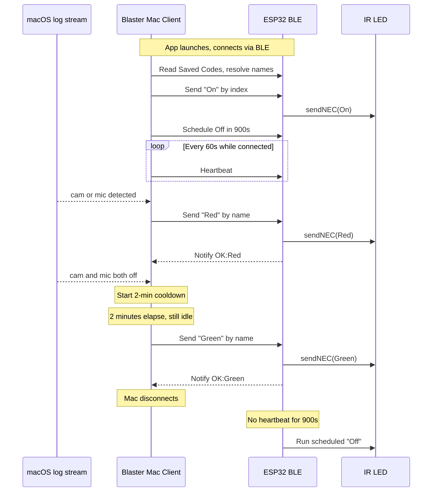

# Blaster Mac Client

A macOS command-line app that monitors camera and microphone usage and sends IR commands to an ESP32-C3 IR Blaster over Bluetooth Low Energy (BLE). Use it to drive a dome light or "on air" indicator: **Red** when the camera or mic is on, **Green** after they've been off for two minutes. The **client** sends **On** when it connects and arms the ESP32 to run **Off** if the client stops sending heartbeats (e.g. after 15 minutes disconnected).

**License:** MIT — see [LICENSE](LICENSE).

**Privacy:** The app runs entirely on your Mac. It reads local macOS logs for camera/mic state and talks only to your IR Blaster over BLE. No telemetry or external servers.

## How it works



- **Camera/mic detection:** Uses macOS `log stream` with the same control-center “sensor-indicators” events that drive the menu bar dots. No polling; events only when state changes.
- **State machine:** IDLE → ACTIVE (cam or mic on) → COOLDOWN (both off) → IDLE after configurable cooldown. The client sends the **Active** command (e.g. Red) when entering ACTIVE and the **Idle** command (e.g. Green) when returning to IDLE.
- **BLE:** Connects to the IR Blaster by name, reads Saved Codes to resolve command **names** to indices, sends commands by name. On connect it sends On, arms the Schedule (e.g. Off in 900s), and sends a heartbeat periodically to reset the timer. Reconnects automatically after disconnect.

## Requirements

- macOS (tested on Sonoma / Sequoia) with Bluetooth
- Python 3.10+
- ESP32-C3 IR Blaster firmware with BLE enabled, powered on, and **paired** with this Mac (default firmware uses Just Works — no passkey)

## Setup

1. **Clone or copy** this project (e.g. next to your `irproject` repo):

   ```bash
   cd ~/Projects
   # create or clone blaster-mac-client
   cd blaster-mac-client
   ```

2. **Create a virtualenv and install dependencies:**

   ```bash
   python3 -m venv .venv
   source .venv/bin/activate
   pip install -r requirements.txt
   ```

3. **Bluetooth permission:** The first time you run the app, macOS may prompt for Bluetooth access. If the IR Blaster never appears, open **System Settings → Privacy & Security → Bluetooth** and ensure your terminal (e.g. Terminal.app or Cursor) is allowed.

4. **Pair the IR Blaster once** (e.g. with nRF Connect or by running this app). With default firmware no passkey is required.

## Usage

From the project root with the venv activated:

```bash
python -m blaster
```

- The app scans for the device named **IR Blaster**, connects, sends **On** (optionally after a short delay), arms the ESP32 to run **Off** after a configurable delay with no heartbeat, and starts sending heartbeats periodically.
- When any app starts using the camera or microphone, the client sends the **Active** command (e.g. Red) by name.
- When both camera and microphone have been idle for the configured cooldown, it sends the **Idle** command (e.g. Green) by name.
- If the Mac disconnects (sleep, out of range), heartbeats stop; the ESP32 runs the scheduled command (e.g. Off) after the configured delay.

Stop with **Ctrl+C**; the client disconnects cleanly.

## Configuration

Edit `config.yaml` in the project root. All commands are specified by **name** (the client resolves names to indices using the device’s Saved Codes).

```yaml
ble:
  device_name: "IR Blaster"

events:
  OnConnect:
    - NamedCommand: "On"
      Delay: 0
    - NamedCommand: "Green"
      Delay: 2
  HeartbeatStopped:         # first item: schedule + HeartbeatInterval
    - NamedCommand: "Off"
      Delay: 900
      HeartbeatInterval: 60
  Active:
    - NamedCommand: "Red"
  Idle:                     # first item's Delay = cooldown before Idle
    - NamedCommand: "Green"
      Delay: 120
```

Every event is a **list** of `{ NamedCommand, Delay? }`. Commands run in order; each `Delay` is seconds to wait before that command (0 = immediately). Single `{ NamedCommand, Delay }` still works for one command.

| Event | Description |
|-------|-------------|
| **OnConnect** | Commands to run when the client connects, in order. |
| **HeartbeatStopped** | First item only: ESP32 runs `NamedCommand` when no heartbeat for `Delay` seconds; `HeartbeatInterval` = how often the client sends a heartbeat. |
| **Active** | Commands when camera or mic turns on (e.g. "Red"). |
| **Idle** | First item's `Delay` = cooldown (seconds) before Idle; then all commands run in order. |

Command names must match the **name** of a saved code on the IR Blaster (web UI or `GET /saved`). The ESP32 has no built-in "On" or "Off"; the client sends On and arms the delayed Off via the Schedule characteristic.

## Running tests

No device required; unit tests only.

```bash
source .venv/bin/activate
pytest tests/ -v
```

## Troubleshooting

- **“Could not find or connect to IR Blaster”**  
  Ensure the IR Blaster is powered, in range, and already paired with this Mac. Check **System Settings → Bluetooth**. If you use a different terminal (e.g. Cursor), grant it Bluetooth access under **Privacy & Security → Bluetooth**.

- **“Device not found”**  
  macOS often does not list custom BLE GATT servers in the Bluetooth menu. Use this app (or nRF Connect) to connect; after pairing once, reconnection is automatic.

- **Camera/mic state not updating**  
  The app uses `log stream` with `com.apple.controlcenter` / `sensor-indicators`. If you’re on an older macOS, the predicate or message format may differ; run `blaster/av_monitor.py` as a script to print initial state and live events and confirm events are received.

- **Command not found**  
  Command names in `config.yaml` (e.g. "Red", "Green", "On", "Off") must match the **name** of a saved code on the IR Blaster. Check the web UI or `GET /saved` for the exact names.

## Project layout

```
blaster-mac-client/
  config.yaml           # Device name, events (NamedCommand, Delay, HeartbeatInterval)
  requirements.txt
  blaster/
    __init__.py
    __main__.py         # Entry point (python -m blaster)
    config.py           # Load config with defaults
    ble_client.py       # BLE scan, connect, send_command, reconnect
    av_monitor.py       # Camera/mic via log stream
    state_machine.py    # IDLE / ACTIVE / COOLDOWN, 2-min timer
  tests/
    test_config.py
    test_av_monitor.py
    test_state_machine.py
```

This repo is intended to live separately from the IR Blaster firmware repo; point the “IR Blaster” link above to your actual firmware project.
