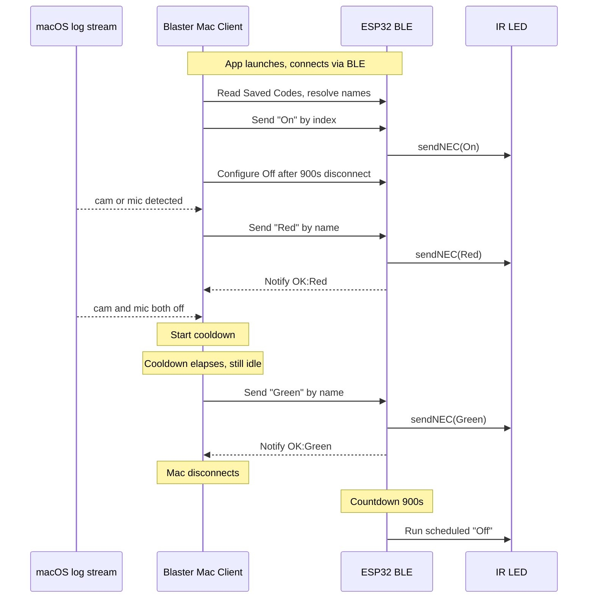

# Blaster Mac Client

A macOS app that monitors camera and microphone usage and sends IR commands to an [ESP32-C3 IR Blaster](https://github.com/newmaniese/ESP-BlasterHub) over Bluetooth Low Energy (BLE). Use it to drive a dome light or "on air" indicator: **Red** when the camera or mic is on, **Green** after they've been off for a configurable cooldown. The client sends **On** when it connects and configures the ESP32 to run **Off** after a delay if BLE disconnects (default: 15 minutes).

**License:** MIT — see [LICENSE](LICENSE).

**Privacy:** The app runs entirely on your Mac. It reads local macOS logs for camera/mic state and talks only to your IR Blaster over BLE. No telemetry or external servers. The management UI binds to localhost only (`127.0.0.1`).

## How it works


```mermaid
sequenceDiagram
    participant Log as macOS log stream
    participant App as Blaster Mac Client
    participant BLE as ESP32 BLE
    participant IR as IR LED

    Note over App,BLE: App launches, connects via BLE
    App->>BLE: Read Saved Codes, resolve names
    App->>BLE: Send "On" by index
    BLE->>IR: sendNEC(On)
    App->>BLE: Configure Off after 900s disconnect

    Log-->>App: cam or mic detected
    App->>BLE: Send "Red" by name
    BLE->>IR: sendNEC(Red)
    BLE-->>App: Notify OK:Red

    Log-->>App: cam and mic both off
    Note over App: Start cooldown

    Note over App: Cooldown elapses, still idle
    App->>BLE: Send "Green" by name
    BLE->>IR: sendNEC(Green)
    BLE-->>App: Notify OK:Green

    Note over App: Mac disconnects
    Note over BLE: Countdown 900s
    BLE->>IR: Run scheduled "Off"
```

- **Camera/mic detection:** Uses macOS `log stream` with the same control-center “sensor-indicators” events that drive the menu bar dots. No polling; events only when state changes.
- **State machine:** IDLE → ACTIVE (cam or mic on) → COOLDOWN (both off) → IDLE after the Idle cooldown. The client sends the **Active** command (e.g. Red) when entering ACTIVE and the **Idle** command (e.g. Green) when returning to IDLE. A command with a `Delay` is dropped if cam/mic state changes while it waits, so a late send cannot leave the wrong color showing.
- **BLE:** Scans for the configured device name in the **advertised** BLE local name, reads Saved Codes to resolve command **names** to indices, and sends commands by name. On connect it runs **OnConnect** and configures the disconnect **Schedule**, then re-sends the Active or Idle command if **OnConnect** left a color that disagrees with the current camera/mic state. While connected it sends Schedule heartbeats every 60s so the ESP32’s GATT-idle watchdog does not drop a healthy idle link. It retries automatically if the device is missing or the link drops.

## Requirements

- macOS (tested on Sonoma / Sequoia) with Bluetooth
- Python 3.10+ (bundled by the installer into a local venv)
- [ESP32-C3 IR Blaster](https://github.com/newmaniese/ESP-BlasterHub) firmware with BLE enabled, powered on, and **paired** with this Mac (default firmware uses Just Works — no passkey)

## Install from a release

1. Download the latest `blaster-mac-client.zip` from [Releases](https://github.com/newmaniese/blaster-mac-client/releases).
2. Unzip it (anywhere is fine, including Downloads).
3. In Terminal:

   ```bash
   cd blaster-mac-client
   chmod +x install.sh && ./install.sh
   ```

The installer:

1. Copies the app to `~/Library/Application Support/blaster-mac-client` (never overwrites an existing `config.yaml` there).
2. Creates a virtualenv and installs dependencies.
3. Installs and loads a LaunchAgent so the client starts at login and restarts if it exits.

Open the management UI: **[http://127.0.0.1:8765](http://127.0.0.1:8765)**

Logs (rotated): `~/Library/Logs/blaster-mac-client/blaster.log` (and `blaster.log.1` …). LaunchAgent still captures process stderr at `stderr.log`, but the app only mirrors WARNING+ there when not attached to a terminal. Set `BLASTER_LOG_LEVEL=DEBUG` (or pass `--log-level DEBUG`) when debugging.

After installing you can delete the unzipped folder. To remove the installed app: run `./uninstall.sh` from a copy of the project, or see [Uninstall](#uninstall).

Pair the IR Blaster once (this app or nRF Connect). With default firmware no passkey is required. If the light never responds, check **System Settings → Privacy & Security → Bluetooth** and allow `blaster-mac-client`.

## Management UI

While the app is running, open **[http://127.0.0.1:8765](http://127.0.0.1:8765)** (localhost only).

| Section | What you can do |
|---------|-----------------|
| **Status** | Connection state, configured device name, state machine (idle / active / cooldown), camera and mic on/off, last command / light color, and any error message. |
| **Controls** | **Reconnect** to the BLE device. Buttons for each saved IR command on the connected blaster (loaded from the device). |
| **Configuration** | Edit device name and event commands, then **Save & apply**. |

Saving config writes `config.yaml` next to the running install and safely restarts the BLE session with the new settings. You do **not** need to reload the LaunchAgent for config changes.

## Configuration

Edit settings in the management UI, or edit `config.yaml` directly:

| How you run | Config file the app uses |
|-------------|---------------------------|
| Installed via `install.sh` | `~/Library/Application Support/blaster-mac-client/config.yaml` |
| From source (`python -m blaster` / `./run.sh`) | `config.yaml` next to the `blaster/` package in the project tree |

The UI always edits whichever file the running process loaded. Re-running `./install.sh` never overwrites an existing installed `config.yaml`.

All commands are specified by **name**. The client resolves names to indices using the device’s Saved Codes. Names must match a saved code on the IR Blaster (check the ESP32’s own web UI or `GET /saved` on the device).

```yaml
ble:
  device_name: "IR Blaster"

events:
  OnConnect:
    - NamedCommand: "On"
      Delay: 0
    - NamedCommand: "Green"
      Delay: 2
  OnDisconnect:             # first item only: disconnect schedule
    - NamedCommand: "Off"
      Delay: 900
  Active:
    - NamedCommand: "Red"
      Delay: 0
  Idle:                     # first item's Delay = cooldown before Idle
    - NamedCommand: "Green"
      Delay: 120
```

Every event is a **list** of `{ NamedCommand, Delay? }`. Commands run in order; each `Delay` is seconds to wait before that command (`0` = immediately). A single `{ NamedCommand, Delay }` object still works for one command.

| Field / event | Description |
|---------------|-------------|
| **`ble.device_name`** | Exact BLE advertised name to connect to (case-insensitive). Must match the firmware `BLE_DEVICE_NAME` (and what System Settings → Bluetooth shows). |
| **OnConnect** | Commands when the client connects, in order. |
| **OnDisconnect** | First item only: ESP32 runs `NamedCommand` `Delay` seconds after BLE disconnect; reconnect cancels the countdown. Default delay is 900s if unset/`0`. |
| **Active** | Commands when camera or mic turns on (e.g. `"Red"`). |
| **Idle** | First item's `Delay` = cooldown (seconds both cam and mic must stay off) before Idle commands run; then all Idle commands run in order. |

If you rename the blaster in firmware, set `device_name` to the new advertised name (UI or `config.yaml`) and save. Discovery matches the **live advertisement**, not macOS’s cached peripheral name.

## Behavior summary

- Scans for `ble.device_name`, connects, runs **OnConnect**, and configures the ESP32 disconnect schedule from **OnDisconnect**.
- When any app uses the camera or microphone, sends **Active** (e.g. Red).
- When both have been idle for the Idle cooldown, sends **Idle** (e.g. Green).
- If the Mac disconnects (sleep, out of range), the ESP32 starts the countdown and runs the scheduled command unless the client reconnects first.
- If connect fails at startup or after a config change, the client keeps retrying on its own.

## Run from source

For development, or if you prefer not to use a release zip:

```bash
git clone https://github.com/newmaniese/blaster-mac-client.git
cd blaster-mac-client
python3 -m venv .venv
source .venv/bin/activate
pip install -r requirements.txt
python -m blaster
```

Or: `make run` (via `run.sh`).

Optional flags:

```bash
python -m blaster --config /path/to/myconfig.yaml
python -m blaster --port 9000
```

Stop with **Ctrl+C**; the client disconnects cleanly.

To install that tree as the login agent: `chmod +x install.sh && ./install.sh` (or `make install`). After changing code, re-run `./install.sh` so `~/Library/Application Support/blaster-mac-client` picks up the new files.

### Why it installs to `~/Library/Application Support`

A LaunchAgent inherits no privacy (TCC) grants, so launchd cannot read `~/Desktop`, `~/Documents`, `~/Downloads`, or iCloud Drive. An agent pointed at a project in one of those folders dies immediately with:

```
shell-init: error retrieving current directory: getcwd: cannot access parent directories: Operation not permitted
bash: /Users/you/Downloads/blaster-mac-client/run.sh: Operation not permitted
```

`~/Library/Application Support` is not protected, so installing there means the agent runs with **no permission prompts and no Full Disk Access**. The agent launches `.venv/bin/python -m blaster` directly (not `run.sh`), so it needs no shell and never installs dependencies at login.

### Uninstall

```bash
./uninstall.sh
```

Or manually:

```bash
launchctl unload ~/Library/LaunchAgents/com.blaster-mac-client.plist
rm -rf ~/Library/LaunchAgents/com.blaster-mac-client.plist
rm -rf ~/Library/Application\ Support/blaster-mac-client
```

Logs under `~/Library/Logs/blaster-mac-client` are left in place.

`./install-launchd.sh` is a thin wrapper that calls `install.sh`.

## Troubleshooting

- **“Could not find or connect to IR Blaster” / device not found**  
  Ensure the blaster is powered, in range, and paired. Confirm `ble.device_name` matches the name in **System Settings → Bluetooth** (and the firmware `BLE_DEVICE_NAME`). Grant Bluetooth access under **Privacy & Security → Bluetooth** for the app that owns the process (for the LaunchAgent install, allow `blaster-mac-client`).

- **Device renamed but the app still can’t find it**  
  Update **Device name** in the management UI (or `config.yaml`) to the new advertised name and Save & apply. Current builds match the advertisement, so a stale macOS cache alone should not block discovery.

- **macOS Bluetooth menu doesn’t list the blaster**  
  Custom BLE GATT servers often do not appear as classic Bluetooth accessories. Use this app (or nRF Connect) to connect; after pairing once, reconnection is automatic.

- **Camera/mic state not updating**  
  The app uses `log stream` with `com.apple.controlcenter` / `sensor-indicators`. On older macOS the predicate or message format may differ; run `blaster/av_monitor.py` as a script to print initial state and live events.

- **Command not found**  
  Names in `config.yaml` (e.g. `"Red"`, `"Green"`, `"On"`, `"Off"`) must match a **saved code name** on the IR Blaster. Check the ESP32 web UI or `GET /saved` on the device.

- **`Operation not permitted` in the LaunchAgent logs**  
  The agent is still pointed at a privacy-protected folder. Run `./install.sh` again so it lives under `~/Library/Application Support/blaster-mac-client`.

- **Need more detail in the logs**  
  Re-run with `--log-level DEBUG`, or set `BLASTER_LOG_LEVEL=DEBUG` in the LaunchAgent environment and reload. App output lives in `~/Library/Logs/blaster-mac-client/blaster.log` (rotated at 2 MiB × 5).

## Packaging for GitHub Releases

Maintainers: from the project root,

```bash
make package
```

writes `dist/blaster-mac-client.zip` (excludes `.venv`, `.git`, caches, and logs). Attach that zip to a [GitHub Release](https://github.com/newmaniese/blaster-mac-client/releases):

```bash
gh release create v1.0.0 dist/blaster-mac-client.zip \
  --title "v1.0.0" \
  --notes "Install: unzip, then chmod +x install.sh && ./install.sh. See QUICKSTART.txt."
```

The zip includes **QUICKSTART.txt** for recipients.

## Running tests

No device required; unit tests only.

```bash
source .venv/bin/activate
pytest tests/ -v
```

Or: `make test`.

## Project layout

```
blaster-mac-client/
  Makefile              # make venv / test / run / install / uninstall / package / clean
  config.yaml           # Device name, events (NamedCommand, Delay)
  requirements.txt
  run.sh                # One-step run from source (creates venv if needed)
  install.sh            # Copy to ~/Library/Application Support + LaunchAgent
  uninstall.sh          # Unload the agent and delete the installed copy
  com.blaster-mac-client.plist  # LaunchAgent template (INSTALL_DIR / LOG_DIR)
  QUICKSTART.txt        # Short instructions for release zip recipients
  blaster/
    __main__.py         # Entry point (python -m blaster)
    app.py              # AppController: BLE lifecycle, status, reconnect, config restart
    logging_setup.py    # Log levels + rotating blaster.log
    web.py              # Localhost HTTP UI + JSON API (default :8765)
    static/             # Status / controls / config UI
    config.py           # Load/save config with defaults
    ble_client.py       # BLE scan (advertised name), connect, send_command
    av_monitor.py       # Camera/mic via log stream
    state_machine.py    # IDLE / ACTIVE / COOLDOWN
  tests/
```

This repo is the Mac client. Firmware for the ESP32 lives in [ESP-BlasterHub](https://github.com/newmaniese/ESP-BlasterHub).
